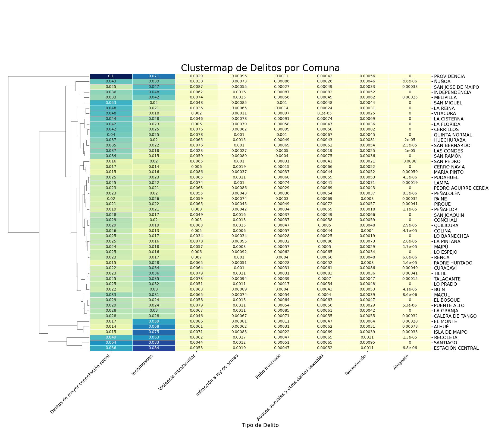
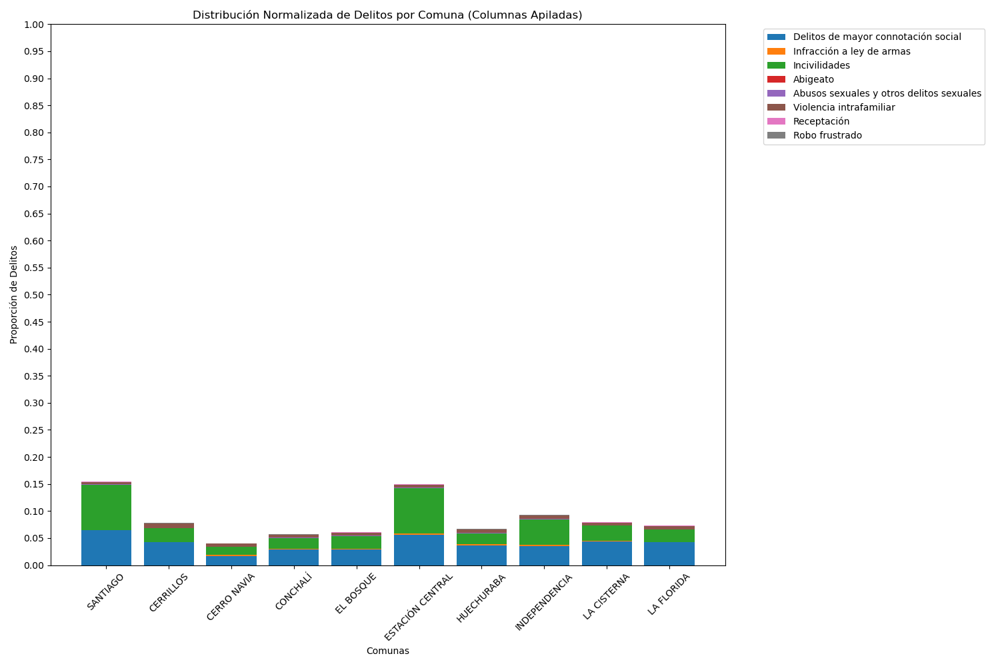
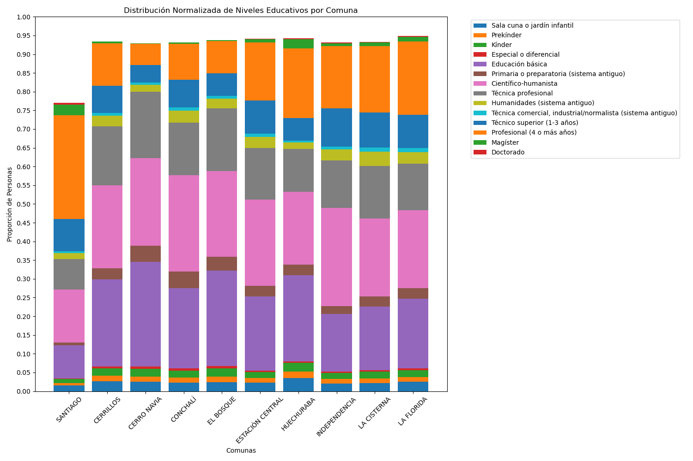
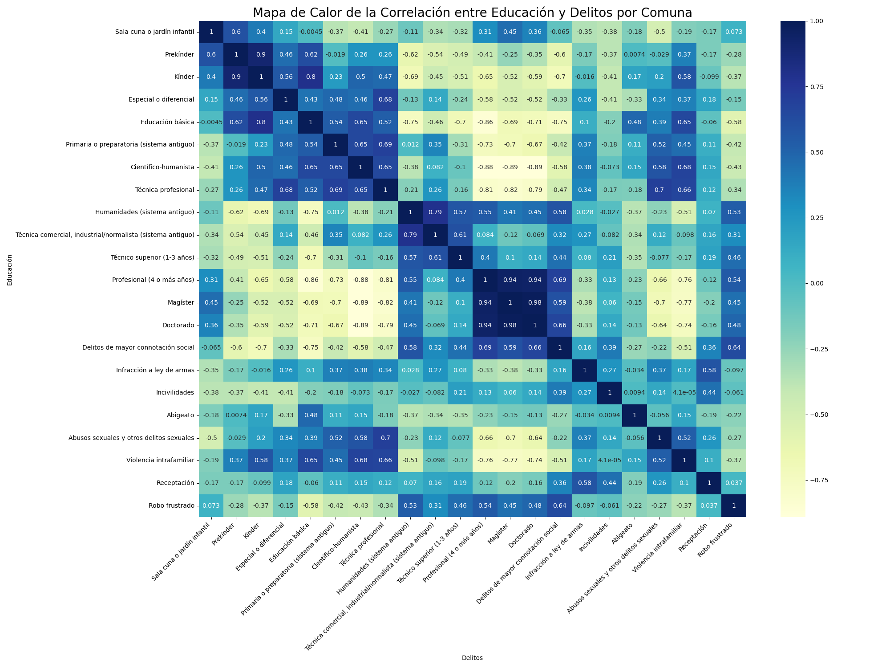
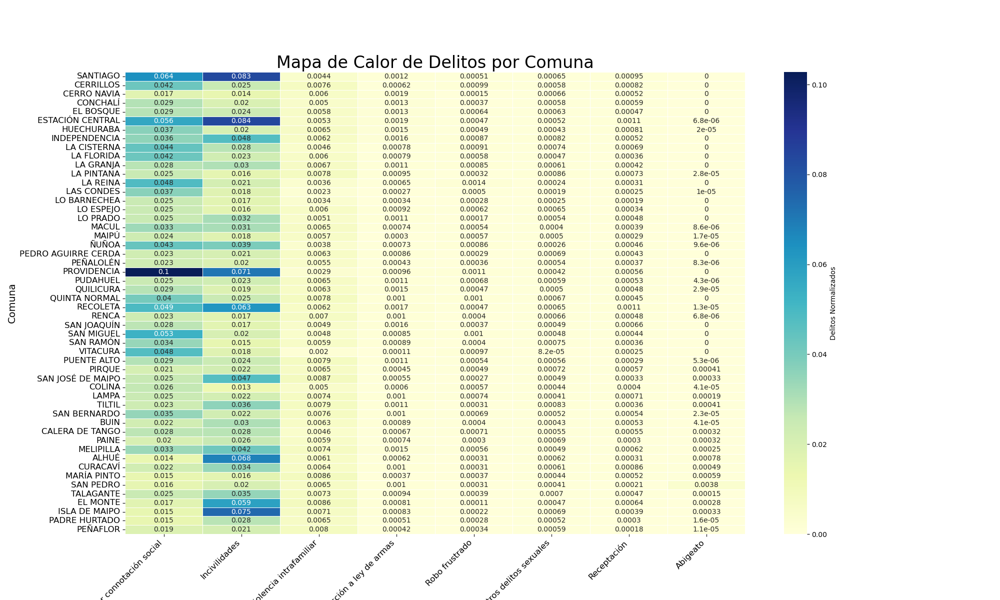

# TViz-Examen

## Descripción

Este proyecto tiene como objetivo visualizar de manera efectiva los delitos y la educación por comuna en la región metropolitana. El equipo está compuesto por Felipe Alonso, Bruno Caro y Isidora Riquelme.

## Contenido del repositorio

- **/data**: Datos utilizados para las visualizaciones.
- **/notebooks**: Notebooks de Jupyter con análisis y visualizaciones.
- **/results**: Resultados finales y gráficos generados.
- **README.md**: Este archivo con información sobre el proyecto.

## Visualizaciones

### Clusterización de Delitos por Comuna

### Distribución Normalizada de Delitos por Comuna

### Distribución Normalizada de Niveles Educativos por Comuna

### Mapa Coropletas del Porcentaje de Delitos por Comuna en Santiago

### Mapa de Calor de la Correlación entre Educación y Delitos por Comuna

### Mapa de Calor de Delitos por Comuna

