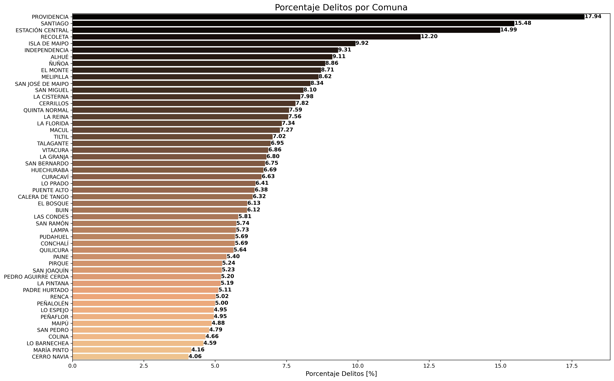
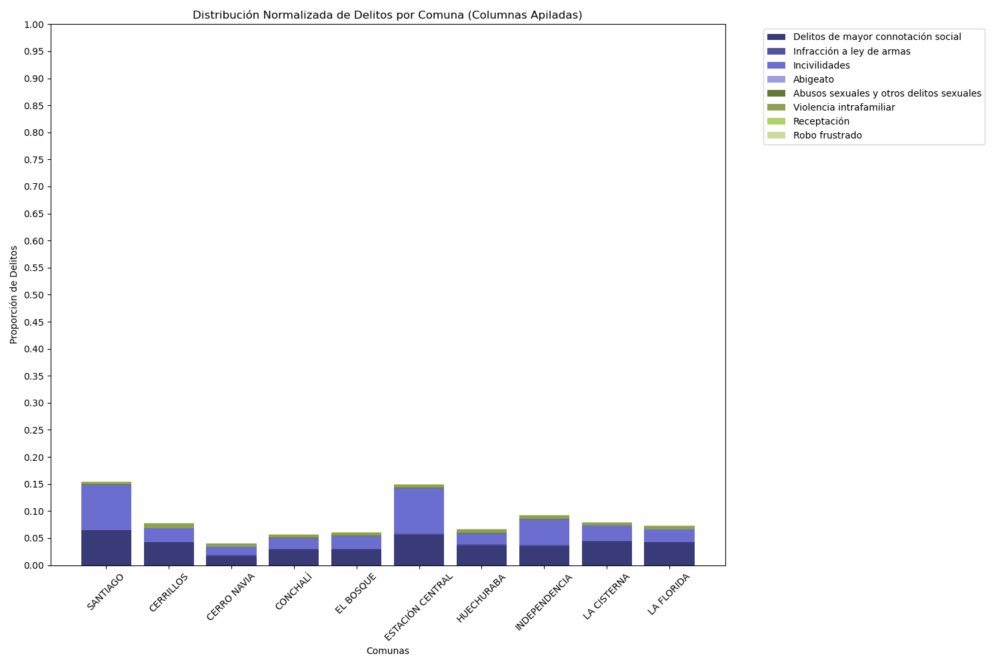
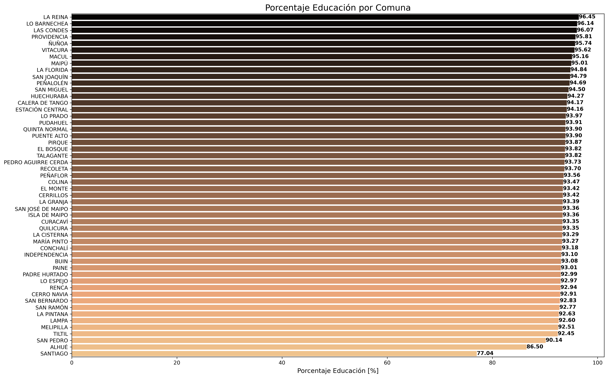
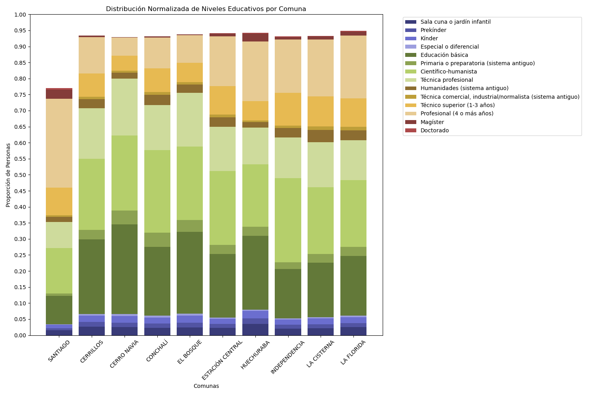
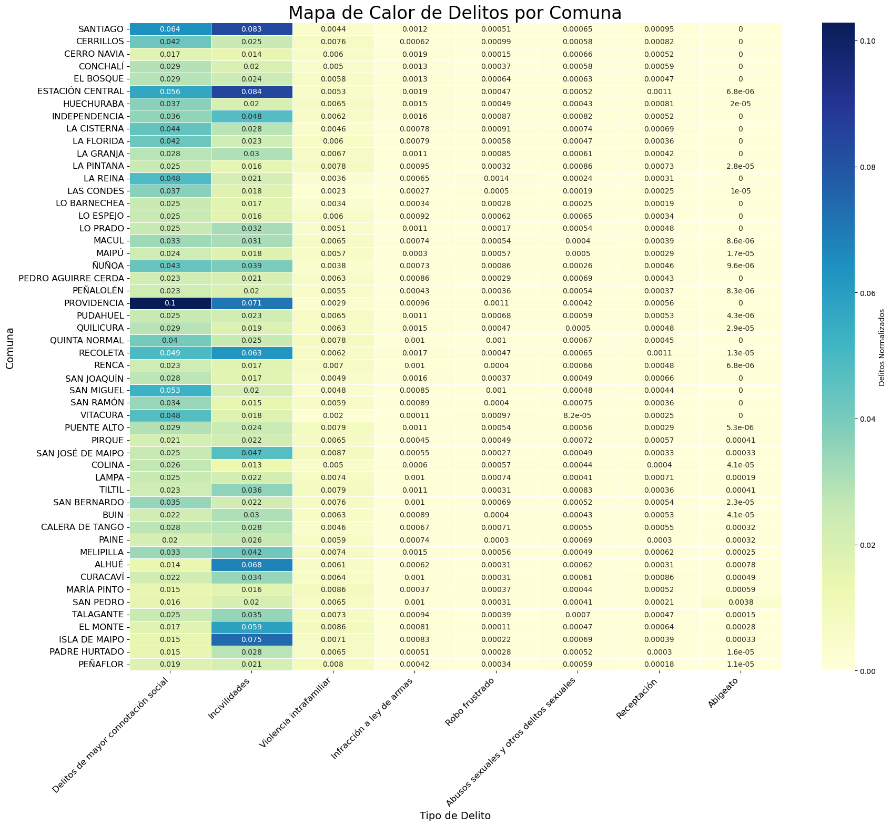
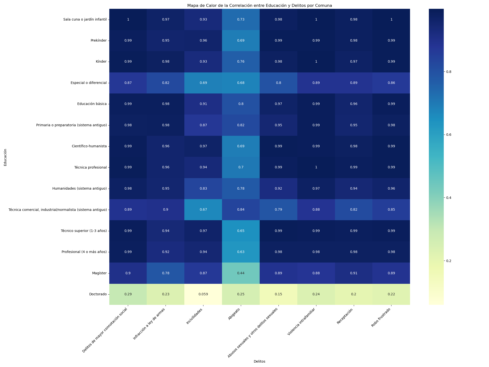
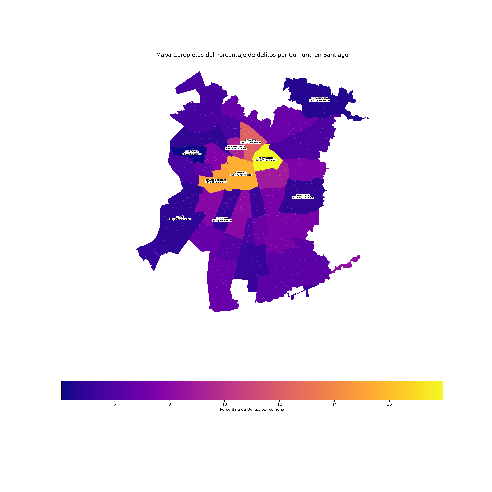

# TViz-Examen

## Resumen

Este proyecto tiene como objetivo visualizar de manera efectiva los delitos y la educación por comuna en la región metropolitana. El equipo está compuesto por Felipe Alonso, Bruno Caro y Isidora Riquelme.
De esta forma, se realizó la hipótesis 'La educación alcanzada por los habitantes de la comuna, tiene relación con los delitos cometidos en la comuna', realizando visualizaciones de datos obtenidos del Censo realizado en 2017, obteniendo como datos el nivel académico máximo alcanzado. Para complementar, se usan los datos obtenidos del Centro de Estudios y Análisis del Delito.
Obteniendo las posteriores visualizaciones los integrantes concluyen en que la educación de la comuna no afecta en los delitos cometidos en la misma, sino que por otros factores, de los cuales se suponen para estudios futuros.
- El movimiento de las personas; es decir, lugares de concentración de trabajo/estudio pde la población.

## Contenido del repositorio

- **/Data**: Datos utilizados para las visualizaciones.
- **/Notebooks**: Notebooks de Jupyter con análisis y visualizaciones.
- **/Resultados**: Resultados finales y gráficos generados.
- **README.md**: Este archivo con información sobre el proyecto.

## Visualizaciones

### Gráfico de Barras del porcentaje de Delitos (total) por Comuna

### Distribución Normalizada de Delitos por Comuna / Gráfico de Barras 

### Gráfico de Barras del porcentaje de Educación (total) por Comuna

### Distribución Normalizada de Niveles Educativos por Comuna / Gráfico de Barras

### Mapa de Calor de Delitos por Comuna

### Clusterización de Delitos por Comuna

### Mapa de Calor de la Correlación entre Educación y Delitos por Comuna

### Mapa Coropletas del Porcentaje de Delitos por Comuna en Santiago

